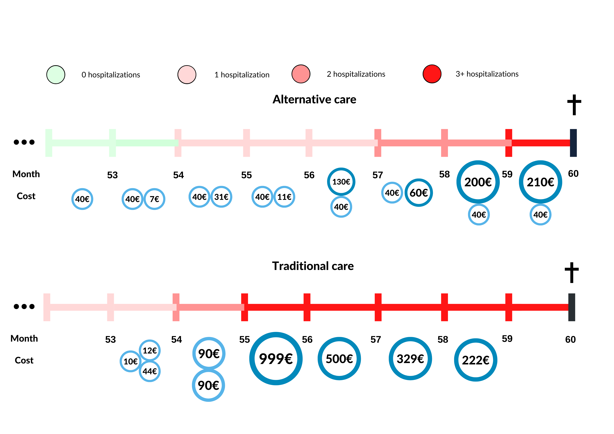

#### PASS information

**Title**: Heart Failure Trajectory Modelling and Cost Study

**Protocol version identifier**: 1.0

**Date of last version of protocol**: 15.12.2022

**EU PAS register number**:

**Active substance**:

**Medicinal product**:

**Research question and objectives**:

**Country(-ies) of study**: Estonia, TBA

**Authors**: Markus Haug, MSc

# 2. LIST OF ABBREVIATIONS

| Abbreviation | Meaning                                            |
| :----------- | ------------------------------------------------:  |
| CDM          | Common data model                                  |
| HF           | Heart failure                                      |
| OHDSI        | Observational Health Data Sciences and Informatics |
| OMOP         | Observational Medical Outcomes Partnership         |
| SoC          | Standard of care                                   |
| TM           | Telemonitoring                                     |
| UTARTU       | University of Tartu                                |

# 3. RESPOSIBLE PARTIES

## 3.1. INVESTIGATORS AND AUTHORS

| Investigator/Author | Institution/Affiliation                     |
| :------------------ | -----------------------------------------:  |
| Markus Haug         | University of Tartu                         |
| Raivo Kolde         | University of Tartu                         |

## 3.2 Sponsor

(?)

# 4. Abstract

Electronically stored medical records offer a rich source of data for investigating treatment trajectories and identifying best practices in healthcare. These trajectories, which consist of medical interventions, give us a foundation to evaluate the economics of treatment patterns and model the treatment paths. The aim of this work is to introduce a technical solution for the aforementioned tasks. The work of two R-packages will be presented. The packages use OHDSI OMOP CDM cohorts to construct treatment trajectories and implement these to compose Markov models.

# 5. AMENDMENTS AND UPDATES

| Number | Date | Section of study protocol | Amendment or update | Reason |
| :----- | :--- | :------------------------ | :------------------ | :----- |
| V1 | 12.2022 | All | Launch | Initiation |
# 6. RATIONALE AND BACKROUND

In 2020 Thokala *et al* published a paper^[Developing Markov Models From Real-World Data: A Case Study of Heart Failure Modeling Using Administrative Data] on a [heart failure study](https://doi.org/10.1016/j.jval.2020.02.012), where they modelled patients' observational health data with Markov Chains and used cost-effectiveness analysis to determine whether Telemonitoring (TM) would be a feasible new treatment in comparison of the standard of care (SoC). In the paper they were contingent on transparent methods for making important medical decisions (whether or not start using TM in treatment). This motivated the authors to develop tools for running such studies on OMOP CDM data having the goal to make such studies easily distributable, transparent and reproducible. Now we have undergone and developed two R-packages which will help to reproduce such studies on OMOP CDM and wish to create a pilot trial using the same structure as published by Thokala *et al*. This trial would provide valuable insights that would aid in the ongoing development of the packages.

Heart failure (HF) currently accounts for 1% to 2% of the annual healthcare budget in most developed countries and is associated with high levels of morbidity and mortality. TM can facilitate early detection of clinically significant changes and earlier intervention to restabilize the syndrome and prevent emergency admissions. There have been studies of cost-effectiveness of TM compared with usual care for HF, estimated using modeling, to help decision makers assess value for money.

A range of modeling techniques have been used, but cohort-based Markov models have been the most commonly used methods in health technology assessment, as they are relatively simple to develop, debug, analyze, and communicate^[Modeling good research practices—overview: a report of the ISPOR-SMDM Modeling Good Research Practices Task Force–1]. Markov models are described in terms of the conditions that individuals can be in (“health states”), how they can move between such states (“transitions”), and how likely such moves are (“transition probabilities”) within a given time period (“cycle length”).

Markov models can be specified in a number of different ways using different choices of state definitions, one of the possibilities, clinical measures, are frequently used. The OHDSI community and data partners also store much medical data which could be used for developing similar models. Therefore it makes much sense to develop such tool for OMOP CDM. We are packaging the study and creating an opportunity for all data partners with HF data to run the same study. The aforementioned R-packages are very handy for conducting such studies and could be used to enforce such studies for the  OHDSI OMOP community in the future.

# 7. RESEARCH QUESTIONS AND OBJECTIVES

The aim of this study is to model the comparative heart failure patients' movement between the disease acuteness states via health trajectories built by R package [*Cohort2Trajectory*](https://github.com/HealthInformaticsUT/Cohort2Trajectory). The Markov Chain modelling and monetary analysis of the states will be conducted by the R package [*TrajectoryMarkovAnalysis*](https://github.com/HealthInformaticsUT/TrajectoryMarkovAnalysis).

Specifically, the study has the following objectives:

1. Comparing and assessing heart failure Markov Chains and treatment costs between data partners.

2. Assessing whether or not telemonitoring would be a feasible alternative treatment method to the standard of care.

3. Introduce the method packages Cohort2Trajectory and TrajectoryMarkovAnalysis to the OHDSI community.

# 8. REASEARCH METHODS

The study will be conducted on OMOP CDM version 5.3. We will define the target cohort, HF state cohorts and learn Markov model parameters as well as state cost parameters. Later we will use TM hazard ratios from earlier publications to calculate corresponding Markov Chains and then later conduct cost-effectiveness analysis.  

## 8.1 STUDY DESIGN

We start with constructing the target cohort and after that the health states HF0, HF1, HF2, HF3 and HFD as defined before. Using the package *Cohort2Trajectory* we will construct trajectories for each patient showing their status monthly. The observation period of each patient is 5 years before the subject's death. That is 60 months, meaning that each patient will contribute to the Markov chain for 60 cycles (see Figure 1).

The Markov chain's parameters (transition probabilities) will be calculated using the maximum likelihood estimation. This and the states' cost analysis will be conducted by the *TrajectoryMarkovAnalysis* package. The states costs will be queried from the OMOP CDM *cost* table. If the data partner has not populated the *cost* table they can still participate in the study contributing with the Markov chain parameters. Individually the packages output linear patient treatment trajectories and Markov chains (see Figure 2) with cost statistics respectively.

## 8.2 SETTING

All of the patients have been divided into monthly states which are constructed as follows:

1) HF0 - the patient has had zero hospitalizations in relation to heart failure the past year;

2) HF1 - the patient has had one hospitalization in relation to heart failure the past year;

3) HF2 - the patient has had two hospitalizations in relation to heart failure the past year; 

4) HF3 - the patient has had at least three hospitalizations in relation to heart failure the past year; 

5) HFD - the patient died during the ongoing month;

### 8.2.1 STUDY POPULATION: TARGET COHORT

All patients included in the study are:

1) 18 years or older;

2) have had at least 1 hospitalization in relation to heart failure;

3) die at least in five years after having first heart failure diagnosis (observation period 5 years);

#### Cohort entry event: 
 Earliest visit occurrence five years before death.
#### Cohort inclusion criteria: 
 1) Having at least one death occurrence;
 2) Having at least one impatient visit related to a diagnosis of heart failure;
 3) Being at least 18 years old before cohort inclusion.
#### Cohort exit criteria:
 Any death or passing of five years.
 
 

### 8.2.1 STUDY POPULATION: STATE COHORTS

**STATE COHORT #1: HF0**
Cohort entry event:

 1) Any visit having zero hospitalizations in relation to heart failure in the last 365 days.

Cohort inclusion criteria: 

 1) Having at least one death occurrence;

 2) Having at least one impatient visit related to a diagnosis of heart failure;

 3) Being at least 18 years old before cohort inclusion.

Cohort exit criteria:

 1) End of continuous observation or any death or any occurrence of visit related to heart failure.

**STATE COHORT #2: HF1**

Cohort entry event: 

 1) Any visit having one hospitalizations in relation to heart failure in the last 365 days.

Cohort inclusion criteria: 

 1) Having at least one death occurrence;

 2) Having at least one impatient visit related to a diagnosis of heart failure;

 3) Being at least 18 years old before cohort inclusion.

Cohort exit criteria:

 1) End of continuous observation or any death or any occurrence of visit related to heart failure.

**STATE COHORT #3: HF2**

Cohort entry event: 
 
 1) Any visit having two hospitalizations in relation to heart failure in the last 365 days.

Cohort inclusion criteria: 

 1) Having at least one death occurrence;
 
 2) Having at least one impatient visit related to a diagnosis of heart failure;
 
 3) Being at least 18 years old before cohort inclusion.
 
Cohort exit criteria:

 1) End of continuous observation or any death or any occurrence of visit related to heart failure.

**STATE COHORT #4: HF3**

Cohort entry event: 

 1) Any visit having three or more hospitalizations in relation to heart failure in the last 365 days.

Cohort inclusion criteria: 

 1) Having at least one death occurrence;

 2) Having at least one impatient visit related to a diagnosis of heart failure;

 3) Being at least 18 years old before cohort inclusion.

Cohort exit criteria:

 1) End of continuous observation or any death or any occurrence of visit related to heart failure.

**STATE COHORT #5: HFD**

Cohort entry event: 

1) Any death having at least one hospitalization in relation to heart failure before dying.

## 8.3 DATA MANAGEMENT

## 8.4 DATA ANALYSIS

# 9. PROTECTION OF HUMAN SUBJECTS

The study uses only de-identified data. Confidentiality of patient records will be maintained at all times. Data custodians will remain in full control of executing the analysis and packaging results. There will be no transmission of patient-level data at any time during these analyses. Only aggregate statistics will be captured. Study packages will contain minimum cell count parameters to obscure any cells which fall below allowable reportable limits. All study reports will contain aggregate data only and will not identify individual patients or physicians. 

# 10. MANAGEMENT AND REPORTING OF ADVERSE EVENTS/ADVERSE REACTIONS

This study will provide a descriptive summary of individuals having hospitalizations caused by heart failure and dying within five years of observation period. For each database a Markov Chain and aggregated cost analysis will be reported as well as metrics of the learned Markov Chain performance. 

# 11. PLANS FOR DISSEMINATING AND COMMUNICATING STUDY RESULTS

Dissemination activities will be of a scientific nature (articles in scientific journals, presentations at conferences, etc.). Our aim is for these studies to be made available as soon as possible in order to support treatment decisions in the global medical arena.

# 12. REFERENCES

1. Thokala, P., Dodd, P., Baalbaki, H., Brennan, A., Dixon, S. and
Lowrie, K. (2020). Developing Markov Models From Real-World Data: A Case Study
of Heart Failure Modeling Using Administrative Data. Value in Health, 23(6):743–750.
https://doi.org/10.1016/j.jval.2020.02.012.

2. Caro, J.J., Briggs, A.H., Siebert, U., et al. (2012)
Modeling good research practices—overview: a report of the ISPOR-SMDM Modeling Good Research Practices Task Force–1.
Value Health, 15(6):796-803.
https://doi.org/10.1016/j.jval.2012.06.012.
