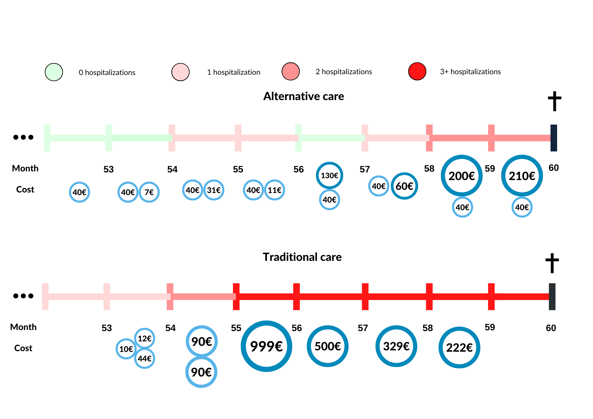
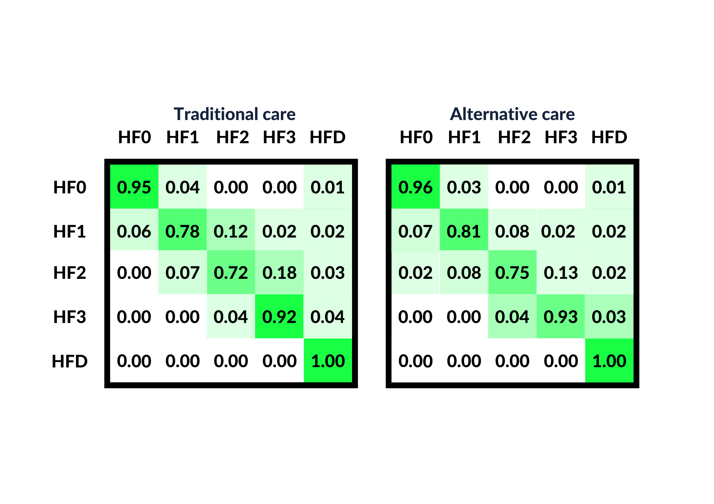

HeartFailureTrajectoryCostStudy
======================

Introduction
============

R-package HeartFailureTrajectoryCostStudy is built for running a heart failure related [study]().

In 2020 Thokala *et al* published a paper on a [heart failure study](https://doi.org/10.1016/j.jval.2020.02.012), where they modelled patients' observational health data with Markov Chains and used cost-effectiveness analysis to determine whether Telemonitoring (TM) would be a feasible new treatment in comparison of the standard of care (SoC). In the paper they were contingent on transparent methods for making important medical decisions (whether or not start using TM in treatment). This motivated the authors to develop tools for running such studies on OMOP CDM data having the goal to make such studies easily distributable, transparent and reproducible. Now we have undergone and developed two R-packages which will help to reproduce such studies on OMOP CDM and wish to create a pilot trial using the same structure as published by Thokala *et al*. This trial would provide valuable insights that would aid in the ongoing development of the packages.

Heart failure (HF) currently accounts for 1% to 2% of the annual healthcare budget in most developed countries and is associated with high levels of morbidity and mortality. TM can facilitate early detection of clinically significant changes and earlier intervention to restabilize the syndrome and prevent emergency admissions. There have been studies of cost-effectiveness of TM compared with usual care for HF, estimated using modeling, to help decision makers assess value for money.

A range of modeling techniques have been used, but cohort-based Markov models have been the most commonly used methods in health technology assessment, as they are relatively simple to develop, debug, analyze, and communicate. Markov models are described in terms of the conditions that individuals can be in (“health states”), how they can move between such states (“transitions”), and how likely such moves are (“transition probabilities”) within a given time period (“cycle length”).

Markov models can be specified in a number of different ways using different choices of state definitions, one of the possibilities, clinical measures, are frequently used. The OHDSI community and data partners also store much medical data which could be used for developing similar models. Therefore it makes much sense to develop such tool for OMOP CDM. We are packaging the study and creating an opportunity for all data partners with HF data to run the same study. The aforementioned R-packages are very handy for conducting such studies and could be used to enforce such studies for the  OHDSI OMOP community in the future.

Features
========

Learning dicrete Markov models for heart failure disease progression.

Learning average costs of each state.

Visualizing patient disease trajectories.

Calculating ICER for standard of care vs alternative treatment (Telemonitoring). 

Design
======

All patients included (target cohort) in the study are:

1) 18 years or older;

2) have had at least 1 hospitalization in relation to heart failure;

3) die at least in five years after having first heart failure diagnosis (observation period 5 years);

All of the patients have been divided into monthly states (state cohorts) which are constructed as follows:

1) HF0 - the patient has had zero hospitalizations in relation to heart failure the past year;

2) HF1 - the patient has had one hospitalization in relation to heart failure the past year;

3) HF2 - the patient has had two hospitalizations in relation to heart failure the past year;

4) HF3 - the patient has had at least three hospitalizations in relation to heart failure the past year;

5) HFD - the patient died during the ongoing month;

We start with constructing the target cohort and after that the health states HF0, HF1, HF2, HF3 and HFD. Using the package *Cohort2Trajectory* we will construct trajectories for each patient showing their status monthly. The observation period of each patient is 5 years before the subject's death. That is 60 months, meaning that each patient will contribute to the Markov chain for 60 cycles.

The Markov chain's parameters (transition probabilities) will be calculated using the maximum likelihood estimation. This and the states' cost analysis will be conducted by the *TrajectoryMarkovAnalysis* package. The states costs will be queried from the OMOP CDM *cost* table. If the data partner has not populated the *cost* table they can still participate in the study contributing with the Markov chain parameters. Individually the packages output linear patient treatment trajectories and Markov chains with cost statistics respectively.

Technology
==========
HeartFailureTrajectoryCostStudy is an R study package, implemented on OMOP CDM.

The package capitalises on the R-packages of [Cohort2Trajectory](https://github.com/HealthInformaticsUT/Cohort2Trajectory) and [TrajectoryMarkovAnalysis](https://github.com/HealthInformaticsUT/TrajectoryMarkovAnalysis).

For running the package with OMOP CDM, the user must have:
1. Permissions to select on ohdsi cdm data schema.
2. Permissions to select on ohdsi cdm results schema.
3. Permissions to select, create and insert on ohdsi temp/scratch schema.

System Requirements
===================

Getting Started
===============

Study protocol: [HeartFailureTrajectoryCostStudy](https://github.com/HealthInformaticsUT/HeartFailureTrajectoryCostStudy/blob/main/PROTOCOL.html)

Execution code: [codeToRun.R](https://github.com/HealthInformaticsUT/HeartFailureTrajectoryCostStudy/blob/main/extras/codeToRun.R)

After successfully running the study share the results repository with authors for participating in publishing an article!

License
=======
HeartFailureTrajectoryCostStudy is licensed under Apache License 2.0

Development
===========
HeartFailureTrajectoryCostStudy is being developed in R Studio.

# Acknowledgements

1. [Cohort2Trajectory package](https://github.com/HealthInformaticsUT/Cohort2Trajectory) by Markus Haug
2. [TrajectoryMarkovAnalysis](https://github.com/HealthInformaticsUT/TrajectoryMarkovAnalysis) by Markus Haug
3. [TrajectoryViz package](https://github.com/HealthInformaticsUT/TrajectoryViz) by Maarja Pajusalu

